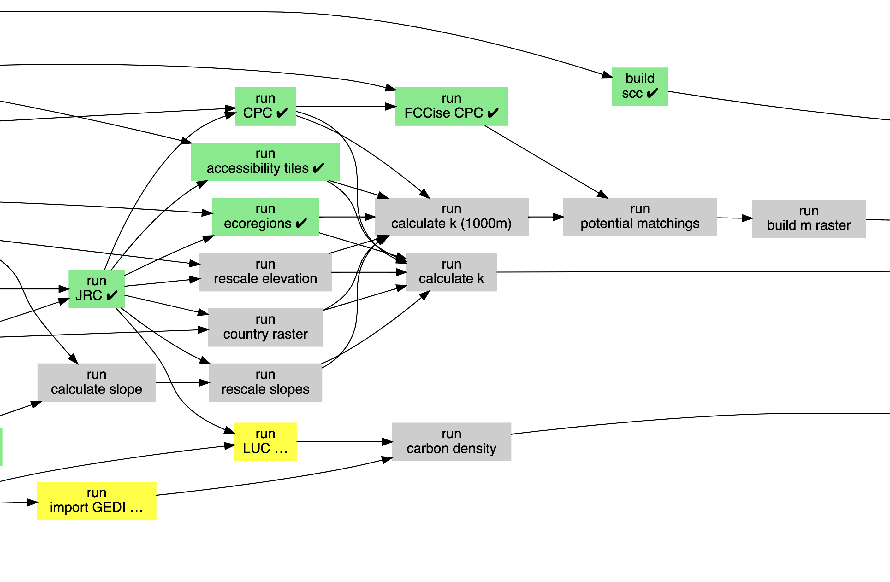

Tropical Moist Forest Evaluation Methodology Pipeline
-----------------------------------------------------

This pipeline provides infrastructure for running the [tropical moist forest
evalulation methodology
implementation](https://github.com/quantifyearth/tmf-implementation) which
itself implements [the open-source, ecological
methodology](https://www.cambridge.org/engage/coe/article-details/647a14a14f8b1884b7b97b55).



## Implementation

This pipeline is written using [OCurrent](https://github.com/ocurrent/ocurrent),
an eDSL in OCaml for building dynamic dataflow programs. We use
[OBuilder](https://github.com/quantifyearth/obuilder) to build and run the
various scripts from the methodology implementation. The actual wiring up and
plumbing is all contained within the
[`evaluate`](https://github.com/carboncredits/tmf-pipeline/blob/main/src/pipeline/lib/evaluations.ml)
function.

### Prerequisites for running

You will also need to setup a snapshotting filesystem for OBuilder to store
build results. One possible backend is ZFS. A quick but probably not very
efficient way to get one setup is with the following using `truncate`:

```
sudo apt install zfsutils-linux
truncate --size XG zfs.img
sudo zpool create obuilder-zfs $PWD/zfs.img
```

You can then run the pipeline with something like:

```
CURRENT_DIR_PREFIX=/some/dir/path dune exec -- ./src/pipeline/bin/main.exe \
    --slack .slack \
    --project-ids 1201,3141,1396,944
    --store=zfs:obuilder-zfs \
    --capnp-secret-key-file=secret-key.pem \
    --capnp-listen-address=unix:/tmp/ocurrent.sock \
    --port=8001
```

## Debugging and Inspecting

The pipeline can be interfaced via the command line, and you can checkout a
specific build. [Hoke](https://github.com/quantifyearth/hoke) is a tool for
accessing a shell for a specific build within the pipeline. This is ephemeral
and will be cleaned up when you exit, but it can be a quick way to get something
running quickly with all the data you need.

```
hoke shell --connect=./secrets/submission.cap --id=<hash>
```
